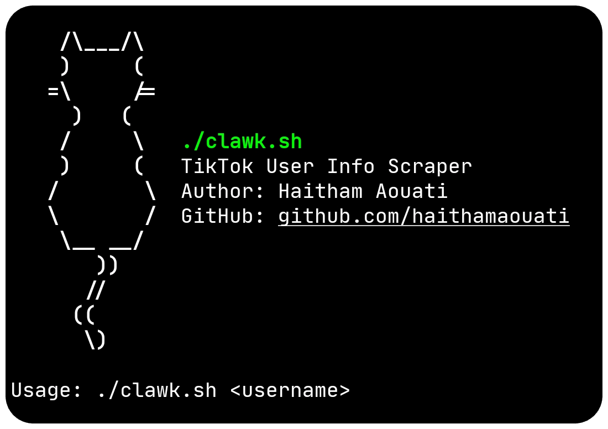

# Clawk

**Authors:** Haitham Aouati & Astro

This bash script allows you to fetch detailed information about TikTok users by their `username`, without requiring logins or API keys. It extracts various user data such as follower counts, video counts, likes, and more.

<p align="center">
  




- Fetch user information by TikTok `username`.
- Works without logins and without using APIs.
- Extracts:
  - User ID
  - Unique ID
  - Nickname
  - Follower count
  - Following count
  - Likes count
  - Video count
  - Biography (signature)
  - Verified status
  - SecUid
  - Comment settings
  - Private account status
  - País (nombre y bandera, si está disponible)
  - Redes sociales asociadas (Instagram, YouTube, Twitter) si están presentes
  - Heart count
  - Digg count
  - Friend count
  - Account created
  - Last username change
  - Last nickname change
  - TikTok profile URL

## Install

To use the Clawk script, follow these steps:

1. Clone the repository:

    ```
    git clone https://github.com/soporte247/Clawk-main-3.0.git
    ```

2. Change to the Clawk directory:

    ```
    cd Clawk-main-3.0
    ```
    
3. Change the file modes
    ```
    chmod +x clawk.sh
    ```
    
5. Run the script:

    ```
    ./clawk.sh
    ```
## Usage

Usage: `./clawk.sh <@username>` or `[username]`


## Dependencies
The script requires the following dependencies:

- **curl**
- **jq**

### Install dependencies on Termux:
```
pkg install curl -y
pkg install jq -y
```

### Install dependencies on Kali Linux:
```
sudo apt update
sudo apt install curl jq -y
```

> [!IMPORTANT]  
> Make sure to install these **dependencies** before running the script.

> [!NOTE]  
> Ensure that the TikTok user account is public to access their information.


## Environment
- Tested on [Termux](https://termux.dev/en/)

## Disclaimer
>[!CAUTION]
>This Tool is only for educational purposes

> [!WARNING]
> We are not responsible for any misuse or damage caused by this program. use this tool at your own risk!

## Star History


[](https://www.star-history.com/#soporte247/Clawk-main-3.0&type=date&legend=top-left)

#### Find this repository useful? ♥️

Support it by joining the [stargazers](https://github.com/soporte247/Clawk-main-3.0/stargazers). ⭐

If you want to help even more, please spread the word — share the project on X, Reddit, or with your community so more people discover it.

And [follow me](https://github.com/haithamaouati) to keep up with future updates and projects. 🤩


## License

Clawk is licensed under [WTFPL license](LICENSE).
